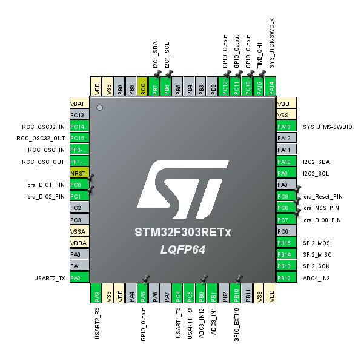

# Optimize Farming with Environmental Indexes Tracking and Irrigation Control via LoRaWAN
This project uses the IBM LMIC library which ported from AVR/espressif and only supports LoRaWan class A, B. I used class A for this project, you may  refer to [LoRaWan classes](https://www.semtech.com/uploads/technology/LoRa/lorawan-device-classes.pdf) for more details before proceeding. 
I recommend using the STM32WB or STM32WL series to fully explore the potential of LoRaWAN with [I-CUBE-LRWAN Expansion Package](https://www.st.com/en/embedded-software/i-cube-lrwan.html). 
## Setup Guide
### Components:
-> STM32F303RET6 
-> ES32-AI-Thinker (leaf detection optional, you can build your own model [here](https://edgeimpulse.com/)) 
-> RFM95(W) 
-> DHT22 
-> BH1750 
-> Capacitive soil moisture sensor 
-> Rain pad (use pull-up resistor) 
-> SSD1306 
-> L298N 
-> 5V relay 
-> Mini560 5V buck converter 
-> 3S 18650 Li-Po 
### Pin assignment:

### How to import project in CubeMX
 _File > Import > Existing Projects into Workspace > Select archive file > ***Where you clone this repo***_

 
